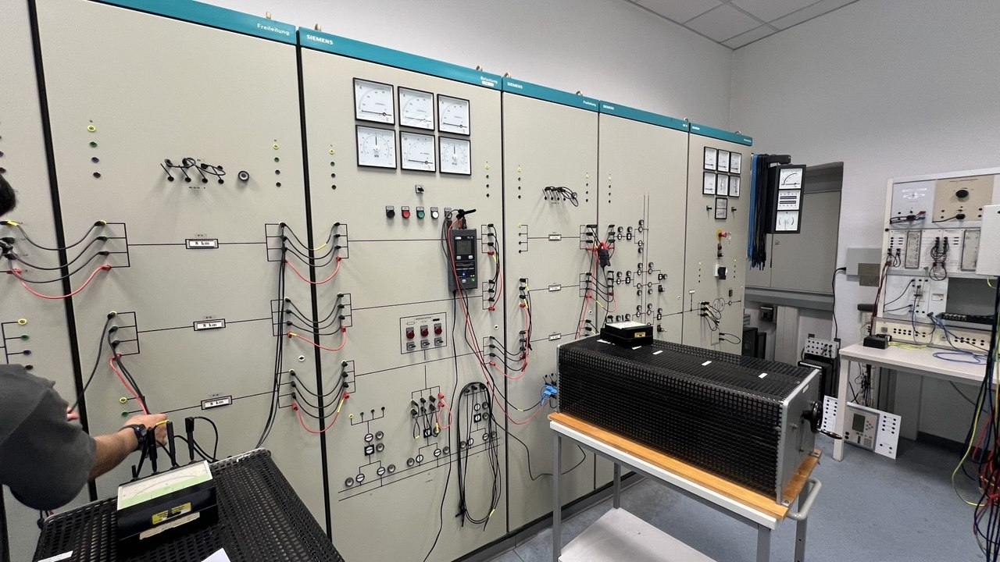

# Transmission Line Analysis and Load Flow

## Overview

This project documents a university practical experiment using a scaled electrical network model to investigate transmission-line characteristics, no-load behaviour, and power flow in a two-sided supply network.

## Part 1 — Transmission-Line Constants

The electrical parameters of a 100 km, 220 kV overhead line are determined using no-load and short-circuit measurements.

The analysis includes resistance, reactance, inductance, capacitance, and conductance, together with the corresponding transmission-line equivalent circuit.

## Part 2 — No-Load Behaviour and Compensation

A 450 km, 220 kV overhead line is investigated under no-load conditions.

The experiment examines the Ferranti effect and compares the influence of shunt-reactor compensation at the sending end and receiving end.

## Part 3 — Load Flow in a Two-Sided Network

A 20 kV network supplied from two sides is investigated under three operating conditions:

* Equal supply voltages
* Outage of overhead line F6
* Unequal supply voltages

The analysis considers voltage and current distribution, active and reactive power, voltage drops, and power losses.

## Key Findings

* **Transmission-line parameters:** No-load and short-circuit measurements were used to determine the electrical parameters of the 100 km overhead-line model.
* **Ferranti effect:** The unloaded 450 km line showed a receiving-end voltage rise. The measured voltage was approximately 158 kV at the receiving end compared with 139.4 kV at the sending end.
* **Reactive-power compensation:** Shunt-reactor compensation reduced the receiving-end voltage. The experiment compared reactor placement at the sending and receiving ends.
* **Load-flow behaviour:** Under equal supply voltages, the lowest measured voltage occurred near Load 2 at approximately 9.5 kV. The line-outage and unequal-voltage cases demonstrated how changes in network configuration affect current and voltage distribution.

### Selected Measurement Results

The table below compares the sending-end and receiving-end voltages of the 450 km overhead line under different compensation conditions.

| Operating condition             | Sending-end voltage | Receiving-end voltage |
| ------------------------------- | ------------------: | --------------------: |
| Uncompensated line              |            139.4 kV |              158.0 kV |
| Sending-end compensation, XL1   |            134.7 kV |              153.2 kV |
| Receiving-end compensation, XL1 |            134.7 kV |              133.5 kV |

The uncompensated line showed a higher voltage at the receiving end, illustrating the Ferranti effect. With the shunt reactor connected at the receiving end, the measured receiving-end voltage was reduced substantially.

The complete measurements and calculations are available in the Excel workbook linked below.

## Documentation and Results

The following files contain the experiment instructions, completed group report, and measurement and calculation results for EA04.

* **[Experiment Instructions](Praktikumsanleitung%20EA04.pdf)** — The original practical instructions covering transmission-line constants, no-load behaviour, and load flow.
* **[Technical Report](Protokoll_E04_Gruppe3.pdf)** — The completed group report, including calculations, measurement results, equivalent circuits, and network diagrams.
* **[Measurement and Calculation Workbook](EA04_Auswertung_V2.xlsx)** — The Excel workbook containing the recorded measurements and supporting calculations.

## Laboratory Setup

*Figure 1: Scaled electrical network model used for the transmission-line and load-flow experiments. The setup includes configurable line sections, switching equipment, loads, and measurement instruments.*

## Technical Focus

Transmission-line equivalent circuits, line parameters, Ferranti effect, reactive-power compensation, load-flow analysis, and network operation under changing supply conditions.

